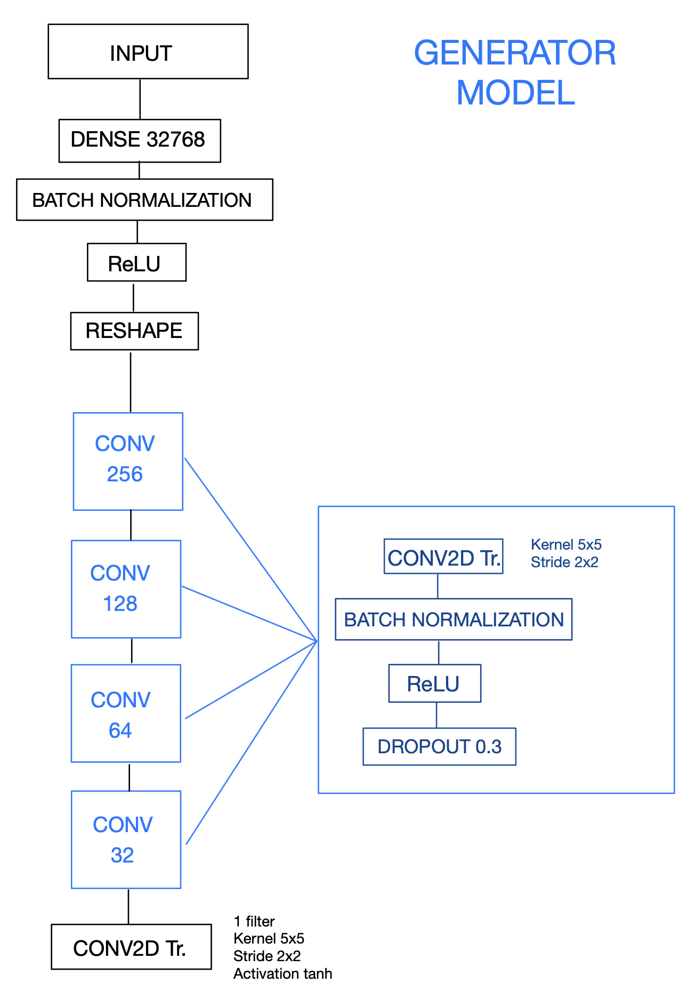
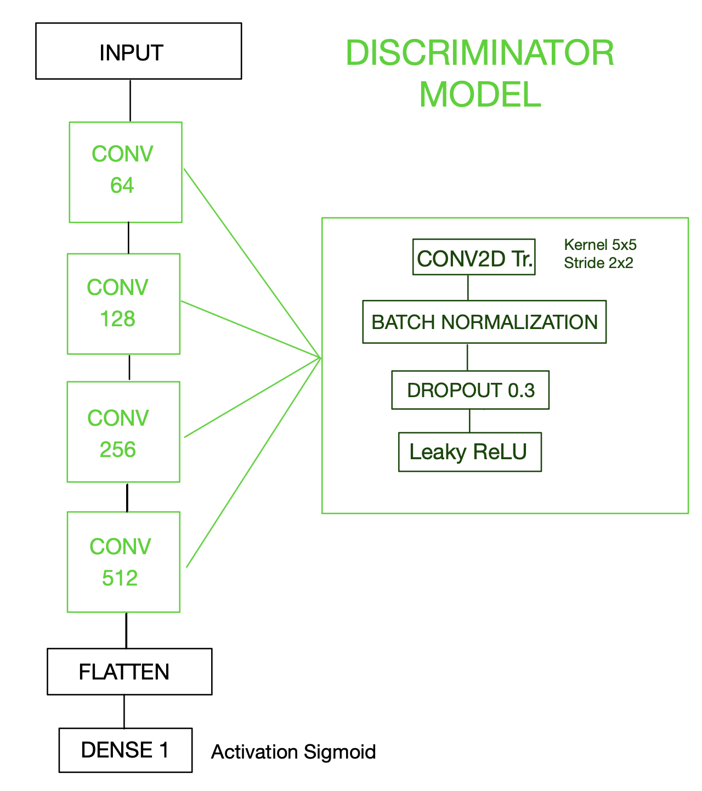
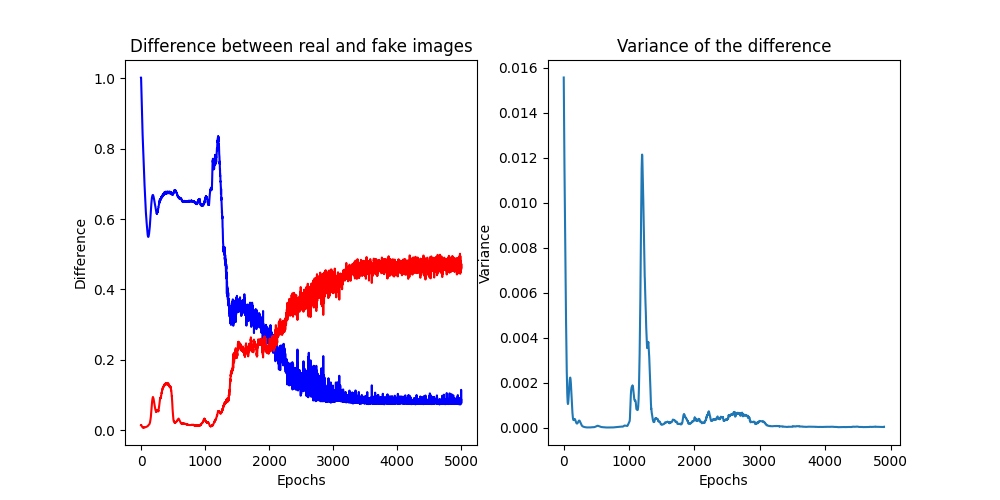
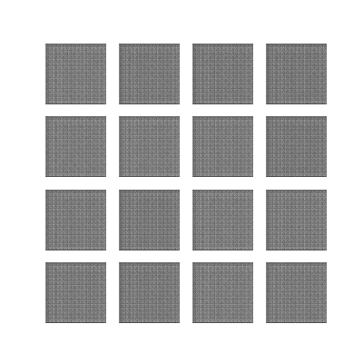
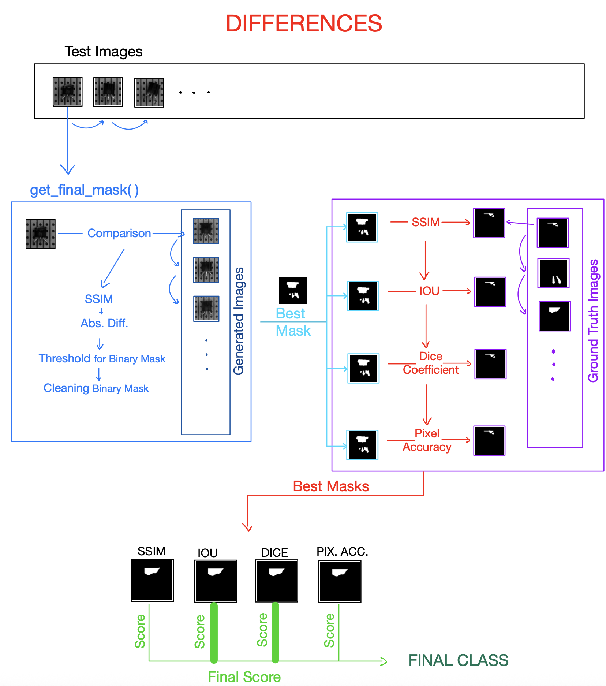
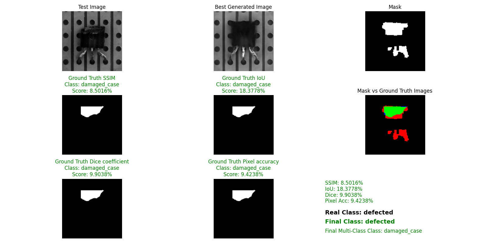
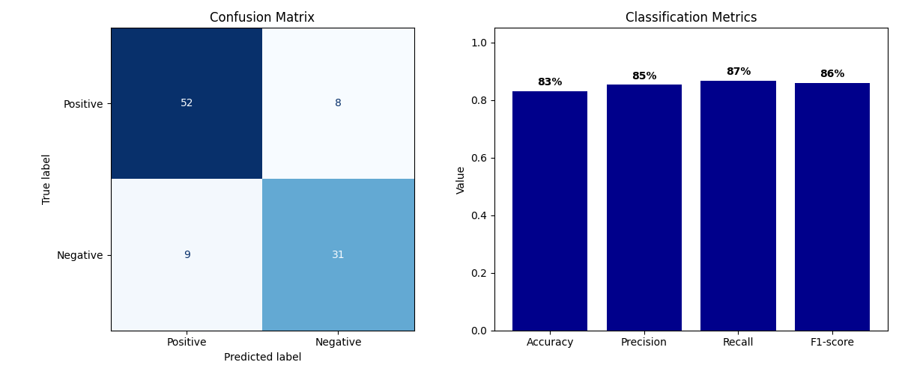
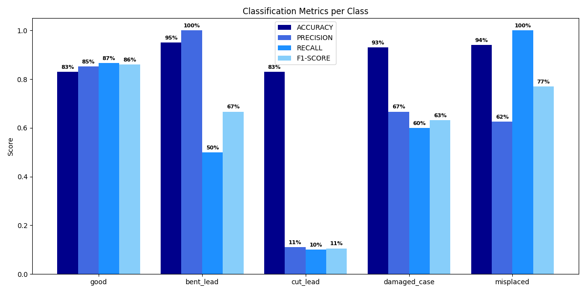

# Anomaly Detection on Transistor Images
## GAN-Based Image Generation and Classification

This project implements a **Generative Adversarial Network (GAN)** in Python to generate synthetic images from a training dataset. The generated images are then used to classify a separate set of test images through a similarity-based comparison with ground truth images. The classification is performed in both **binary** and **multi-class** modes.

---

## Network Architecture

<p align="center">

</p>

The GAN consists of two main components:

### Generator
Learns to produce realistic images that resemble those in the training dataset.

<p align="center">

</p>

### Discriminator 
Attempts to distinguish between real and generated images, guiding the generator to improve.

<p align="center">

</p>

---

## Dataset

- **Training Set**: Set of 1024x1024 RGB images of good transistors used to train the GAN.
- **Test Set**: Set of 100 1024x1024 RGB images to be classified.
- **Ground Truth**: Labeled 1024x1024 binary masks used for evaluation of similarity with the generated content.

---

## Training

- **Epochs**: 5000  
- **Total Time**: Approximately 2 hours and 30 minutes

During training, models and generated images were saved every 100 epochs. The following metrics were tracked throughout the training process to monitor the quality of the generated images and the convergence of the network:

- **Absolute Difference** between real and generated images (blue line)
- **SSIM (Structural Similarity Index)** between real and generated images (red line)
- **Variance** of the absolute difference across epochs

<p align="center">
   
</p>
These plots help visualize how well the generator learns to approximate the distribution of real images over time.

### Training Progress Animation

<div align="center">
  
</div>

## Classification Process

1. Each test image is compared with the generated images to obtain the most similar one.
2. A **binary mask** is created based on visual similarity.
3. This mask is compared with the corresponding ground truth image using the following metrics:
   - **SSIM (Structural Similarity Index)** – *Weight: 10%*
   - **IoU (Intersection over Union)** – *Weight: 40%*
   - **Dice Coefficient** – *Weight: 40%*
   - **Pixel Accuracy** – *Weight: 10%*
4. The weighted combination of these metrics determines the final class of the test image.

<p align="center">

</p>

### Classification Result Example

For each test image, the generated image with the highest similarity is displayed. Next to it, the binary mask obtained from the comparison between the images is shown, along with the ground truth binary masks obtained using the various algorithms. Finally, the results for each algorithm and the actual and predicted classes are displayed.

<p align="center">

</p>

---

## Results

- **Binary Classification Accuracy**:  `83%`

- **Multi-Class Classification Accuracy**:  `74%`

- **Binary Classification Metrics Graph**:  

<p align="center">

</p>

- **Multi-class Classification Metrics Graph**:  

<p align="center">

</p>

---

## Execution

To run the project, execute the `main.py` file. 
At the beginning of the file, set the `mode` variable to specify the desired action:

```python
mode = "train"       # Train the GAN model
mode = "generate"    # Generate images using the trained model
mode = "differences" # Classify test images using the generated images
```
